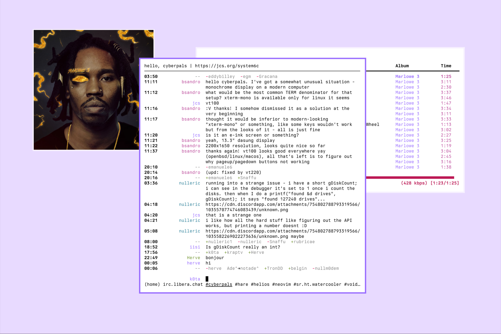

# Dots

Collection of all my configurations (dot files). They are organized into
subdirectories for each program. The vast majority of the configs are meant to
be installed/managed with GNU Stow some however, use make.

This repo contains git submodules for zsh and vim plugins. Meaning you should
clone with the following command.

`git clone --recursive     git@git.sr.ht:~kota/dots`

Discussion can be found [here](https://lists.sr.ht/~kota/public-inbox).

